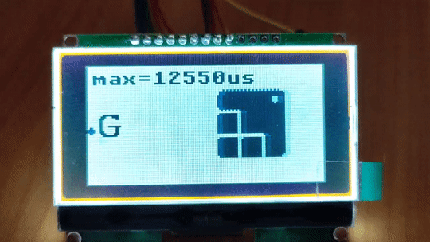

## stm32f103(CubeMX LL) + gmg12864_06D_v2.2(SPI) + LVGL 

Software:
- STM32CubeMX 6.8
- GNU Arm Embedded Toolchain 10 2021.10
- mingw810_64 (make.exe)
- LVGL 8.3 ( https://lvgl.io )

Hardware:
- MCU stm32f103c8t6
- Display GMG12864_06D_v2.2 (SPI)

## LVGL

Use Label, Image and GIF (letter 'G' on the left side)

## Memory consumption (used LL):
```
   text    data     bss     dec     hex filename
  58432     172    5516   64120    fa78 build/test_gmg12864.elf
```


