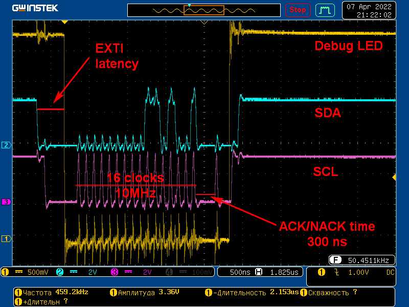

# попытка обработать нестандартный протокол через EXTI+SPI

## Hardware
- MCU stm32f103c8t6

## Software
- CubeMX
- MDK ARM Keil 

## Описание протокола

Протокол похож на i2c с некоторыми отличиями. Опишу лишь необходимую в этом проекте часть:

- Передача по 2 линиям, SDA и SCL
- Данные меняются только при SCL=0
- Скорость передачи 10 МГц. Т.е. каждый такт на линии SCL через 100 нс.
- Передача начинается (starting combination) переходом линии SDA 1->0, SCL 1->0. Между фронтами 100 нс.
- Передача заканчивается (finish combination) переходом линии SDA 0->1, SCL 0->1. Между фронтами 100 нс.
- От начала передачи, до первого такта на линии SCL проходит 300 нс. 
- Передача словами по 16 бит.
- После последнего такта слова данных принимающее устройство должно послать ACK/NACK. Отправляющее устройство ожидает 300 нс до на линии SCL. При этом чтение ACK происходит уже через 200 нс.
- После такта ACK до окончания передачи проходит 200 нс.

Передача имитируется другой stm32

## Особенности обработки приёма

Попытка не увенчалась успехом, т.к. для включения приемника SPI при падении уровня SDA по EXTI-прерыванию времени не хватает:
- вход в прерывание занимает от 12 тактов процессора https://community.arm.com/arm-community-blogs/b/architectures-and-processors-blog/posts/beginner-guide-on-interrupt-latency-and-interrupt-latency-of-the-arm-cortex-m-processors
- выполнение каждой инструкции в прерывании занимает до 4 тактов процессора. Это связано с тем, что Flash-память работает на частоте 24 МГц - выставляется Flash-latency = two-wait-latency

В итоге не хватает времени даже запустить SPI до того, как начинается передача (200 нс или 14 тактов процессора).

