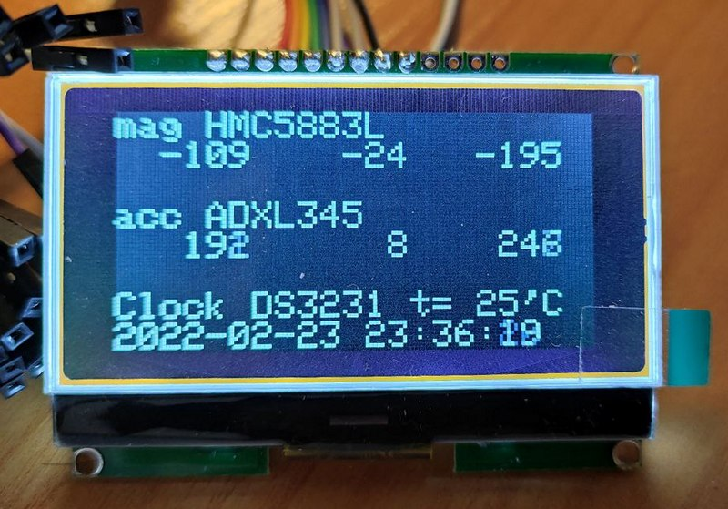

## stm32f103 + sensors

Software:
- STM32CubeMX 6.4
- GNU Arm Embedded Toolchain 10 2021.10
- mingw810_64 (make.exe)

Hardware:
- MCU stm32f103c8t6
- Display GMG12864_0.6D_v2.2
- 3-axis magnitometer HMC5883L (i2c) (Auto calibration doesn't work)
- 3-axis accelerometer ADXL345 (spi) (Only 8-bit mode)
- Clock DS3231 (i2c) (Only read and set, w/o alarm)
- (-) GPS GY-NEO6MV2 (uart)
- (-) Current CJMCU-226 (i2c)
- (-) Humidity / Temperature Sensor Module HTU21D (i2c)

